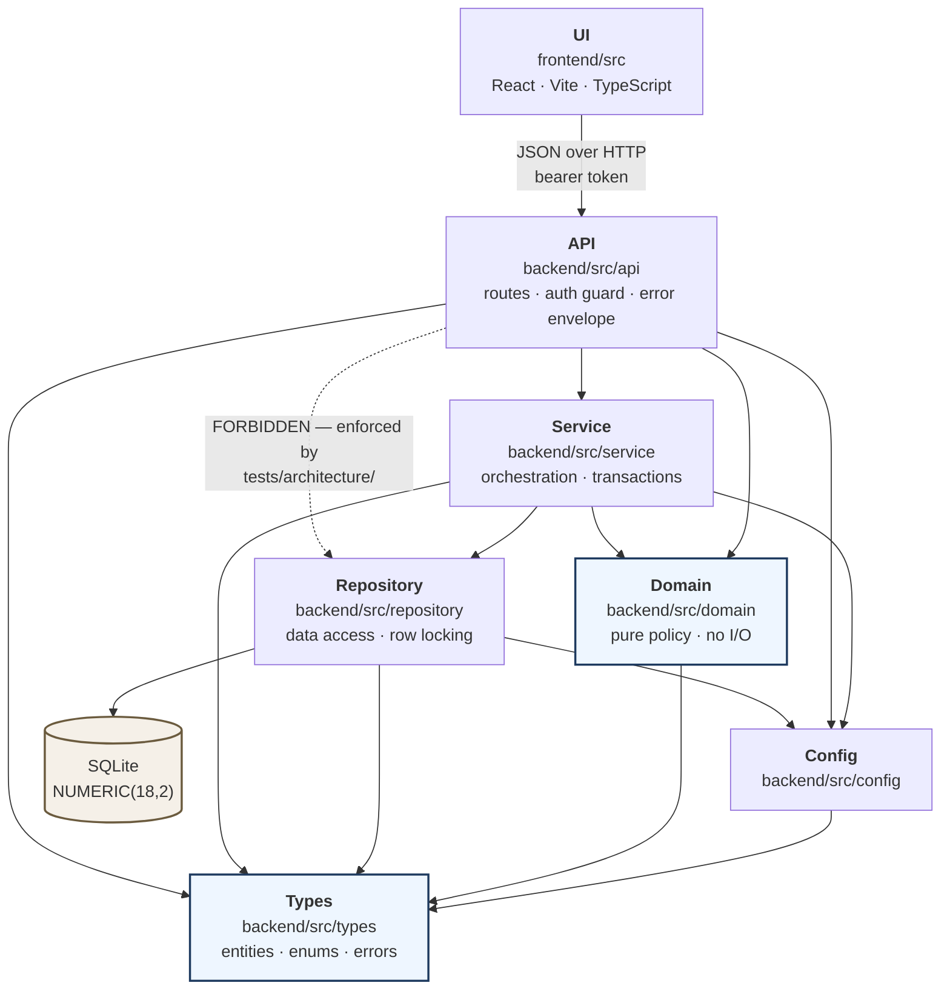
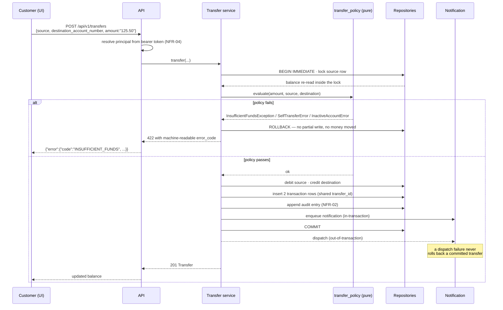
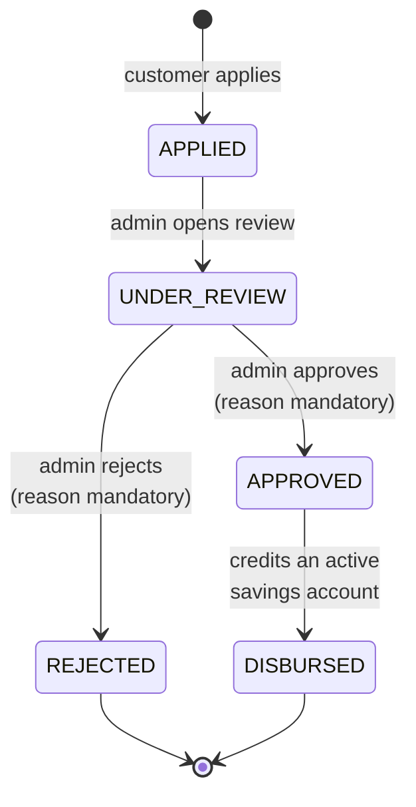

# Architecture — ClaudeForge Banking Suite

Business Case BC-AINE-001. This is the engineering-facing architecture document required by
brief §7.4. Design rationale lives in `specs/design/system-design.md`; entity detail in
`specs/design/data-models.md`.

## 1. Layered structure

A layered modular monolith. Dependencies point one way only:
`types → config → domain → repository → service → api → ui`.

The dashed edge is the violation the rubric cares about most: **a controller must never call a
repository directly.** It is enforced three ways — a structural test in `tests/architecture/`,
an import-linter contract, and `.claude/hooks/check-architecture.js` at write time (`NFR-08`).

`domain/` is a dependency-free sibling of `types/`: pure functions over value objects, no
database handle, no session. That is what makes the four policy modules unit-testable in
isolation and satisfies brief §7.2's requirement of at least four rule/policy/validator files.

## 2. Transfer — the atomic path (AC-04, AC-05)

The destination is an **account number supplied directly**. `AC-04` reads "transfer money to
another account" and imposes no beneficiary precondition. Saved beneficiaries (`AC-06`) are an
independent convenience feature and may only autofill the field.

## 3. Loan lifecycle (AC-07, AC-08)

Any transition outside this matrix is refused with `409 ILLEGAL_LOAN_TRANSITION`. Every transition
appends an immutable `LoanStateTransition` row and raises a notification (`AC-10`).

**There is no eligibility computation.** No principal bounds, no tenure bounds, no income
threshold, no instalment-to-income ratio, no credit score. The brief states no eligibility
criteria, so the approve/reject decision rests entirely with the administrator (`AC-08`).
Validation on apply is structural only.

## 4. Cross-cutting modules

`audit` and `notification` are consumed by accounts, transfers, and loans but depend on none of
them. Audit accepts primitives — `(actor, action, entity_type, entity_id, metadata)` — so no
feature module imports another. This is what lets "audit records transactions" and "transactions
emit audit" coexist without a dependency cycle.

Correlation is middleware at the API edge (`X-Correlation-ID`, generated when absent, echoed on
every response, carried into every log line and audit row). Redaction is a central logging
filter rather than a call-site concern, so no future log statement can leak a card number,
password, token, or KYC document number (`NFR-03`).

## 5. Non-functional requirements → mechanism

| ID | Requirement | Mechanism |
|---|---|---|
| NFR-01 | Fixed-point money | `Decimal` in memory, `NUMERIC(18,2)` at rest, decimal **string** on the wire; `money.py`; `money-precision-check` hook |
| NFR-02 | Append-only audit | No update/delete in the repository API, SQLite triggers, write-time hook |
| NFR-03 | No secrets in logs | Central redaction filter; `pii-scrub` and `detect-secrets` hooks |
| NFR-04 | Auth at the API layer | Bearer dependency + role guard; structural test asserts no anonymous route |
| NFR-05 | Append-only migrations | Alembic policy; migration-history test |
| NFR-06 | Structured JSON logs with correlation ID | Middleware; log-shape tests |
| NFR-07 | `/health` 200 within 1s | Unversioned route, trivial DB round-trip; evaluator probes 5× at 2s backoff |
| NFR-08 | Architecture rules as tests | `tests/architecture/`, import-linter, dependency-cruiser |

## 6. Rules deliberately absent

The brief states exactly ten acceptance criteria and eight non-functional requirements. Where it
is silent, this architecture stays silent. Four rules were proposed during design and
**withdrawn** because no line of BC-AINE-001 supports them:

1. No transfer cap, daily limit, or velocity control.
2. No beneficiary precondition on transfers.
3. No applicant age or date-of-birth eligibility gate.
4. No loan eligibility thresholds of any kind.

Their absence is not left to convention. Stories in `specs/stories/` carry negative assertions
that grep the source for the corresponding identifiers and require zero matches, so a
reintroduced rule fails the test suite rather than passing unnoticed.
