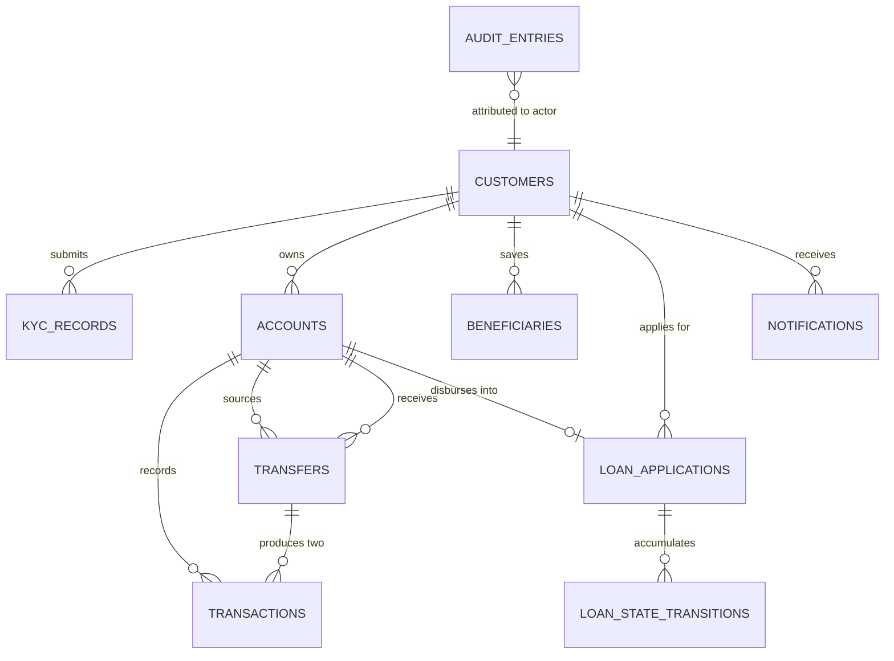

# Data Models — ClaudeForge Banking Suite

| Field | Value |
|---|---|
| Document | `specs/design/data-models.md` |
| Machine-readable form | `specs/design/data-models.schema.json` (JSON Schema draft-07) |
| Datastore | SQLite, file-backed, via SQLAlchemy 2.x |
| Migrations | Alembic, **append-only** (NFR-05) |
| Entity count | 10 |
| Version | 1.0 |
| Date | 2026-08-19 |

Every entity from BRD §9 is specified below. All example records are **synthetic**: reserved
`.test` email domain, `HZN`-prefixed fictional account numbers, invented names.

---

## 1. Conventions

### 1.1 Column types

| Concept | Python | SQLAlchemy | SQLite declared type |
|---|---|---|---|
| Identifier | `uuid.UUID` (stored as `str`) | `String(36)` | `VARCHAR(36)` |
| Money | `decimal.Decimal` | `MoneyType` — a `TypeDecorator` over `Numeric(precision=18, scale=2)` | `NUMERIC(18, 2)` |
| Timestamp | `datetime.datetime` (tz-aware, UTC) | `DateTime(timezone=True)` | `DATETIME` |
| Enum | `str`-subclassing `Enum` from `src/types` | `String(32)` + `CHECK` constraint | `VARCHAR(32)` |
| Free text | `str` | `String(n)` / `Text` | `VARCHAR(n)` / `TEXT` |
| JSON object | `dict[str, Any]` | `JSON` | `JSON` (TEXT-backed) |

### 1.2 The money rule (NFR-01, DD-05, DD-16)

`MoneyType` is a `TypeDecorator` over `Numeric(18, 2)` whose `process_result_value` returns a
`Decimal` quantised to 2 places, never a `float`. SQLite has no native decimal type, so without
this decorator SQLAlchemy would hand back a `float` on read and the invariant would be lost
silently at the persistence boundary — this is the single most likely place NFR-01 breaks.

| Boundary | Representation |
|---|---|
| SQLite at rest | `NUMERIC(18, 2)` — never `REAL`, never `FLOAT` (`F023`) |
| Python memory | `Decimal` — `isinstance(v, float)` is `False` at every layer (`F018`) |
| JSON on the wire | decimal **string**, e.g. `"1234.56"` |
| TypeScript | `string`. **The frontend formats money and performs no arithmetic on it** — no `parseFloat`, no `Number()`, no `+` on a money value (DD-12, `F171`). |

Scale is 2; rounding, where a derived amount ever needs it, is `ROUND_HALF_UP`. No AC requires a
derived money value today — loans end at `DISBURSED` with no repayment schedule (A-04) — so no
derivation exists.

### 1.3 Naming

Tables are plural snake_case (`loan_applications`); columns are snake_case; foreign keys are
`<singular>_id`. Every table has a `id` primary key. Timestamps are UTC.

---

## 2. Entity Relationship Overview



`audit_entries` deliberately has **no foreign key** to the entity it describes: it stores
`entity_type` + `entity_id` as plain columns so the audit module imports nothing from transfers
or loans and no dependency cycle forms (DD-15). `beneficiaries.beneficiary_account_number` is
likewise a plain string, not a foreign key, so a soft-deleted or later-closed payee account never
breaks referential integrity.

---

## 3. Entities

### 3.1 `customers`

The person. Registration creates one in `PENDING_KYC`; a passing KYC verdict flips it to `ACTIVE`.

| Column | Type | Null | Default | Constraints |
|---|---|---|---|---|
| `id` | `VARCHAR(36)` | no | — | PK, UUID v4 |
| `email` | `VARCHAR(254)` | no | — | **UNIQUE**, lower-cased on store. The uniqueness is a DB constraint, not a read-then-write check, so duplicate registration is race-free (`F039`). |
| `password_hash` | `VARCHAR(255)` | no | — | bcrypt or argon2 output. **Never** the plaintext, never logged, never returned by any endpoint. |
| `full_name` | `VARCHAR(200)` | no | — | 1–200 chars |
| `date_of_birth` | `DATE` | no | — | **Profile data only. No rule reads this column.** There is no minimum applicant age and no date-of-birth eligibility gate (DD-14.3, `F035`). |
| `role` | `VARCHAR(32)` | no | `'CUSTOMER'` | `CHECK (role IN ('CUSTOMER','ADMIN'))`. `ADMIN` is set only by `backend/scripts/seed.py`; no route assigns it (`F060`). |
| `status` | `VARCHAR(32)` | no | `'PENDING_KYC'` | `CHECK (status IN ('PENDING_KYC','ACTIVE','SUSPENDED'))` |
| `created_at` | `DATETIME` | no | `CURRENT_TIMESTAMP` | UTC |
| `updated_at` | `DATETIME` | no | `CURRENT_TIMESTAMP` | UTC, touched on status change |

**Relationships:** one-to-many to `kyc_records`, `accounts`, `beneficiaries`,
`loan_applications`, `notifications`.

**Indexes**

| Index | Columns | Why |
|---|---|---|
| `pk_customers` | `id` | Primary key |
| `uq_customers_email` | `email` UNIQUE | Login lookup on every authentication, and the duplicate-registration guard |

**Example**

```json
{
  "id": "7c9e6679-7425-40de-944b-e07fc1f90ae7",
  "email": "ada.tester@horizon.test",
  "password_hash": "$2b$12$X4Kq3rSyntheticHashValueForSeedDataOnly000000000000",
  "full_name": "Ada Tester",
  "date_of_birth": "1991-04-17",
  "role": "CUSTOMER",
  "status": "ACTIVE",
  "created_at": "2026-08-19T09:41:03.117Z",
  "updated_at": "2026-08-19T09:42:10.004Z"
}
```

---

### 3.2 `kyc_records`

The submitted document and its deterministic stub verdict (AC-01, A-02).

| Column | Type | Null | Default | Constraints |
|---|---|---|---|---|
| `id` | `VARCHAR(36)` | no | — | PK |
| `customer_id` | `VARCHAR(36)` | no | — | FK → `customers.id`, `ON DELETE RESTRICT` |
| `document_type` | `VARCHAR(32)` | no | — | `CHECK (document_type IN ('PASSPORT','NATIONAL_ID','DRIVING_LICENCE'))` |
| `document_number` | `VARCHAR(32)` | no | — | `^[A-Z][0-9]{7}$`. **Redacted in every log line** (NFR-03, `F031`). `X0000000` is reserved and always yields `REJECTED` (A-02). |
| `status` | `VARCHAR(32)` | no | `'PENDING'` | `CHECK (status IN ('PENDING','VERIFIED','REJECTED'))` |
| `stub_reason` | `VARCHAR(200)` | **yes** | `NULL` | Populated on `REJECTED` only, e.g. `RESERVED_TEST_DOCUMENT` |
| `verified_at` | `DATETIME` | **yes** | `NULL` | Set on `VERIFIED` only |
| `created_at` | `DATETIME` | no | `CURRENT_TIMESTAMP` | Submission timestamp |

**Relationships:** many-to-one to `customers`.

**Indexes**

| Index | Columns | Why |
|---|---|---|
| `ix_kyc_records_customer_id` | `customer_id` | The duplicate-submission check reads "does this customer hold a VERIFIED record" on every KYC POST (E-10) |

**Example**

```json
{
  "id": "0d9c2f11-6a4b-4a8f-9f3e-2b1c7d5e8a04",
  "customer_id": "7c9e6679-7425-40de-944b-e07fc1f90ae7",
  "document_type": "PASSPORT",
  "document_number": "P1234567",
  "status": "VERIFIED",
  "stub_reason": null,
  "verified_at": "2026-08-19T09:42:10.004Z",
  "created_at": "2026-08-19T09:42:09.981Z"
}
```

---

### 3.3 `accounts`

A savings account. Opens at exactly `0.00` (AC-02). **There is no minimum balance** — one would
contradict AC-02 and is recorded as out of scope (BRD OUT-08).

| Column | Type | Null | Default | Constraints |
|---|---|---|---|---|
| `id` | `VARCHAR(36)` | no | — | PK |
| `customer_id` | `VARCHAR(36)` | no | — | FK → `customers.id` |
| `account_number` | `VARCHAR(13)` | no | — | **UNIQUE**, `^HZN[0-9]{10}$`. The human-quotable handle used as a transfer destination. |
| `type` | `VARCHAR(32)` | no | `'SAVINGS'` | `CHECK (type = 'SAVINGS')` — only savings accounts exist (OUT-07) |
| `balance` | `NUMERIC(18,2)` | no | `0.00` | `CHECK (balance >= 0)`. Read back as `Decimal` via `MoneyType`. Never `REAL`. |
| `currency` | `VARCHAR(3)` | no | `'INR'` | Single currency throughout (A-05) |
| `status` | `VARCHAR(32)` | no | `'ACTIVE'` | `CHECK (status IN ('ACTIVE','CLOSED'))` |
| `opened_at` | `DATETIME` | no | `CURRENT_TIMESTAMP` | UTC |

**Relationships:** many-to-one to `customers`; one-to-many to `transactions`; referenced by
`transfers.source_account_id` and `transfers.destination_account_id`; optionally referenced by
`loan_applications.disbursement_account_id`.

**Indexes**

| Index | Columns | Why |
|---|---|---|
| `uq_accounts_account_number` | `account_number` UNIQUE | `POST /api/v1/transfers` resolves the destination by account number on every transfer — the hottest lookup in the system — and the uniqueness guard for generated numbers (`F069`) |
| `ix_accounts_customer_id` | `customer_id` | `GET /api/v1/accounts` and every ownership check |

**Example**

```json
{
  "id": "b3f1a9d2-8c47-4e6a-9d13-5f2c7e0a1b48",
  "customer_id": "7c9e6679-7425-40de-944b-e07fc1f90ae7",
  "account_number": "HZN0000000241",
  "type": "SAVINGS",
  "balance": "750.00",
  "currency": "INR",
  "status": "ACTIVE",
  "opened_at": "2026-08-19T09:45:00.912Z"
}
```

---

### 3.4 `transactions`

Double-entry ledger rows. **One transfer produces exactly two rows** — one `DEBIT` and one
`CREDIT` — sharing a `transfer_id` (`F071`, `F109`). A loan disbursement produces one `CREDIT`
row with `transfer_id = NULL`. These rows back the statement (AC-03).

| Column | Type | Null | Default | Constraints |
|---|---|---|---|---|
| `id` | `VARCHAR(36)` | no | — | PK |
| `account_id` | `VARCHAR(36)` | no | — | FK → `accounts.id`. The account this row belongs to. |
| `counterparty_account_id` | `VARCHAR(36)` | **yes** | `NULL` | FK → `accounts.id`. `NULL` for a loan disbursement credit. |
| `direction` | `VARCHAR(32)` | no | — | `CHECK (direction IN ('DEBIT','CREDIT'))` |
| `amount` | `NUMERIC(18,2)` | no | — | `CHECK (amount > 0)`. Always the absolute movement; sign is carried by `direction`. |
| `balance_after` | `NUMERIC(18,2)` | no | — | Balance of `account_id` after this row was applied. Read back as `Decimal` (`F072`). |
| `transfer_id` | `VARCHAR(36)` | **yes** | `NULL` | FK → `transfers.id`. Shared by the paired debit and credit. `NULL` for a disbursement. |
| `description` | `VARCHAR(140)` | **yes** | `NULL` | Free text |
| `created_at` | `DATETIME` | no | `CURRENT_TIMESTAMP` | Statement ordering key |

**Relationships:** many-to-one to `accounts` (twice), many-to-one to `transfers`.

**Indexes**

| Index | Columns | Why |
|---|---|---|
| `ix_transactions_account_created` | `(account_id, created_at DESC)` | **Statement pagination.** `GET /api/v1/accounts/{id}/statements` filters by `account_id` and orders `created_at DESC`; this composite index serves both the page slice and the `COUNT(*)` that produces `total`, which is what makes DD-11's `total` field affordable. |
| `ix_transactions_transfer_id` | `transfer_id` | Retrieving both legs of one transfer, and the `F071` assertion that exactly two rows share a `transfer_id` |

**Example**

```json
{
  "id": "e7c1d4a8-3b62-4f19-9c05-7d8e2a4b6f30",
  "account_id": "b3f1a9d2-8c47-4e6a-9d13-5f2c7e0a1b48",
  "counterparty_account_id": "d5b3c1f4-0e69-4a8c-9f35-7b4e9a2c3d60",
  "direction": "DEBIT",
  "amount": "250.00",
  "balance_after": "750.00",
  "transfer_id": "9f8e7d6c-5b4a-4392-8170-1a2b3c4d5e6f",
  "description": "Rent share",
  "created_at": "2026-08-19T11:03:21.552Z"
}
```

---

### 3.5 `transfers`

One row per **attempt**. A `FAILED` attempt is recorded and audited but moved no money (A-08).

| Column | Type | Null | Default | Constraints |
|---|---|---|---|---|
| `id` | `VARCHAR(36)` | no | — | PK. Also the `transfer_id` on both transaction legs. |
| `source_account_id` | `VARCHAR(36)` | no | — | FK → `accounts.id`. Must be owned by the caller. |
| `destination_account_id` | `VARCHAR(36)` | **yes** | `NULL` | FK → `accounts.id`. `NULL` when the destination account number could not be resolved. |
| `destination_account_number` | `VARCHAR(13)` | no | — | The value the caller actually submitted, retained verbatim for forensics even when unresolvable. |
| `amount` | `NUMERIC(18,2)` | no | — | `CHECK (amount > 0)`. **No upper bound: there is no transfer cap, daily limit or velocity control** (DD-14.1). |
| `status` | `VARCHAR(32)` | no | — | `CHECK (status IN ('COMPLETED','FAILED'))` |
| `failure_code` | `VARCHAR(64)` | **yes** | `NULL` | Populated on `FAILED` only. Matches the `error.code` returned to the caller, e.g. `INSUFFICIENT_FUNDS`. |
| `source_balance_after` | `NUMERIC(18,2)` | **yes** | `NULL` | Set on `COMPLETED` only |
| `description` | `VARCHAR(140)` | **yes** | `NULL` | Free text |
| `created_at` | `DATETIME` | no | `CURRENT_TIMESTAMP` | Attempt timestamp |

There is **no `beneficiary_id` column**. The destination is an account number supplied directly;
a saved beneficiary is not required, not referenced and not checked (DD-13, AC-04).

**Relationships:** many-to-one to `accounts` (source and destination); one-to-many to
`transactions` (exactly two on the success path, zero on the failure path).

**Indexes**

| Index | Columns | Why |
|---|---|---|
| `ix_transfers_source_created` | `(source_account_id, created_at DESC)` | `GET /api/v1/transfers` pagination for the caller's history |
| `ix_transfers_status` | `status` | Filtering history by `COMPLETED` / `FAILED` |

**Example — completed**

```json
{
  "id": "9f8e7d6c-5b4a-4392-8170-1a2b3c4d5e6f",
  "source_account_id": "b3f1a9d2-8c47-4e6a-9d13-5f2c7e0a1b48",
  "destination_account_id": "d5b3c1f4-0e69-4a8c-9f35-7b4e9a2c3d60",
  "destination_account_number": "HZN0000000318",
  "amount": "250.00",
  "status": "COMPLETED",
  "failure_code": null,
  "source_balance_after": "750.00",
  "description": "Rent share",
  "created_at": "2026-08-19T11:03:21.552Z"
}
```

**Example — failed (no money moved, no transaction rows written)**

```json
{
  "id": "2b3c4d5e-6f70-4819-a2b3-c4d5e6f70819",
  "source_account_id": "b3f1a9d2-8c47-4e6a-9d13-5f2c7e0a1b48",
  "destination_account_id": "d5b3c1f4-0e69-4a8c-9f35-7b4e9a2c3d60",
  "destination_account_number": "HZN0000000318",
  "amount": "99999.00",
  "status": "FAILED",
  "failure_code": "INSUFFICIENT_FUNDS",
  "source_balance_after": null,
  "description": null,
  "created_at": "2026-08-19T11:01:09.004Z"
}
```

---

### 3.6 `beneficiaries`

A saved payee (AC-06). **Soft-deleted** so historical transaction and audit references are never
orphaned (A-07, DD-19). A convenience feature only: nothing about a transfer consults this table.

| Column | Type | Null | Default | Constraints |
|---|---|---|---|---|
| `id` | `VARCHAR(36)` | no | — | PK |
| `customer_id` | `VARCHAR(36)` | no | — | FK → `customers.id` |
| `nickname` | `VARCHAR(60)` | no | — | The customer's own label, 1–60 chars |
| `beneficiary_name` | `VARCHAR(200)` | no | — | Payee's name, 1–200 chars |
| `beneficiary_account_number` | `VARCHAR(13)` | no | — | `^HZN[0-9]{10}$`. **Not a foreign key** — a plain string, so a later account closure never breaks this row. Validated to resolve at creation time. |
| `created_at` | `DATETIME` | no | `CURRENT_TIMESTAMP` | UTC |
| `deleted_at` | `DATETIME` | **yes** | `NULL` | Soft-delete marker. `NULL` means active. List endpoints filter `deleted_at IS NULL`. |

**Relationships:** many-to-one to `customers`.

**Indexes**

| Index | Columns | Why |
|---|---|---|
| `ix_beneficiaries_customer_active` | `(customer_id, deleted_at)` | `GET /api/v1/beneficiaries` filters by owner and `deleted_at IS NULL` on every call |
| `uq_beneficiaries_active_account` | `(customer_id, beneficiary_account_number)` UNIQUE WHERE `deleted_at IS NULL` | Partial unique index enforcing "no two *active* beneficiaries for the same account number for one customer" (`F101`). Being partial, it permits re-adding a payee that was previously removed. |

**Example**

```json
{
  "id": "5c6d7e8f-9a0b-41c2-83d4-5e6f7a8b9c0d",
  "customer_id": "7c9e6679-7425-40de-944b-e07fc1f90ae7",
  "nickname": "Flatmate",
  "beneficiary_name": "Grace Sample",
  "beneficiary_account_number": "HZN0000000318",
  "created_at": "2026-08-19T11:10:44.870Z",
  "deleted_at": null
}
```

---

### 3.7 `loan_applications`

A personal loan request (AC-07). **No eligibility data is computed or stored.** There is no
principal bound, no tenure bound, no income requirement, no instalment-to-income ratio, no credit
score and no risk band (DD-14.4). Approval is an administrator decision (AC-08).

| Column | Type | Null | Default | Constraints |
|---|---|---|---|---|
| `id` | `VARCHAR(36)` | no | — | PK |
| `customer_id` | `VARCHAR(36)` | no | — | FK → `customers.id` |
| `principal` | `NUMERIC(18,2)` | no | — | `CHECK (principal > 0)`, at most 2 decimal places. **No minimum and no maximum.** |
| `tenure_months` | `INTEGER` | no | — | `CHECK (tenure_months >= 1)`. A positive whole number of months. **No maximum.** |
| `purpose` | `VARCHAR(200)` | no | — | Free text, 1–200 chars. Read by no rule. |
| `declared_monthly_income` | `NUMERIC(18,2)` | **yes** | `NULL` | **Optional and informational. No rule reads this column** (DD-14.4). Present because the applicant may volunteer it, not because anything consumes it. |
| `status` | `VARCHAR(32)` | no | `'APPLIED'` | `CHECK (status IN ('APPLIED','UNDER_REVIEW','APPROVED','REJECTED','DISBURSED'))` |
| `disbursement_account_id` | `VARCHAR(36)` | **yes** | `NULL` | FK → `accounts.id`. Must be an `ACTIVE` `SAVINGS` account owned by the applicant at disbursement time. |
| `created_at` | `DATETIME` | no | `CURRENT_TIMESTAMP` | Application timestamp |
| `updated_at` | `DATETIME` | no | `CURRENT_TIMESTAMP` | Touched on every state change |

**Relationships:** many-to-one to `customers`; optional many-to-one to `accounts`; one-to-many to
`loan_state_transitions`.

**Indexes**

| Index | Columns | Why |
|---|---|---|
| `ix_loan_applications_status_created` | `(status, created_at DESC)` | The admin review queue is "all loans in status X, newest first" — the dominant admin query (`F137`) |
| `ix_loan_applications_customer_id` | `customer_id` | `GET /api/v1/loans` and every ownership check (`F138`) |

**Example**

```json
{
  "id": "3d4e5f60-7182-4939-a4b5-c6d7e8f90a1b",
  "customer_id": "7c9e6679-7425-40de-944b-e07fc1f90ae7",
  "principal": "5000.00",
  "tenure_months": 24,
  "purpose": "Home improvement",
  "declared_monthly_income": "3200.00",
  "status": "APPROVED",
  "disbursement_account_id": "b3f1a9d2-8c47-4e6a-9d13-5f2c7e0a1b48",
  "created_at": "2026-08-19T11:20:00.000Z",
  "updated_at": "2026-08-19T11:41:55.180Z"
}
```

---

### 3.8 `loan_state_transitions`

The immutable history of one loan. Append-only, mirroring the audit ledger: the repository
exposes no update or delete path (`F135`).

| Column | Type | Null | Default | Constraints |
|---|---|---|---|---|
| `id` | `VARCHAR(36)` | no | — | PK |
| `loan_id` | `VARCHAR(36)` | no | — | FK → `loan_applications.id` |
| `from_status` | `VARCHAR(32)` | **yes** | `NULL` | `NULL` for the initial `APPLIED` row. `CHECK` against the status enum. |
| `to_status` | `VARCHAR(32)` | no | — | `CHECK` against the status enum |
| `actor_id` | `VARCHAR(36)` | no | — | FK → `customers.id`. The applicant for `APPLIED`; the administrator for every later transition. |
| `reason` | `VARCHAR(500)` | **yes** | `NULL` | **Mandatory and non-empty when `to_status` is `APPROVED` or `REJECTED`** (AC-08, E-13). Optional on `UNDER_REVIEW` and `DISBURSED`. Enforced in `domain/loan_eligibility_policy.assert_decision_reason` and asserted by a `CHECK` that `to_status NOT IN ('APPROVED','REJECTED') OR (reason IS NOT NULL AND TRIM(reason) <> '')`. |
| `created_at` | `DATETIME` | no | `CURRENT_TIMESTAMP` | Transition timestamp; the chronological ordering key |

**Relationships:** many-to-one to `loan_applications`, many-to-one to `customers` (actor).

**Indexes**

| Index | Columns | Why |
|---|---|---|
| `ix_loan_state_transitions_loan_created` | `(loan_id, created_at ASC)` | The customer-facing timeline is read oldest-first for one loan on every loan detail request (`F136`, `F198`) |

**Example**

```json
{
  "id": "cc33dd44-ee55-4f66-a077-bb88cc99dd00",
  "loan_id": "3d4e5f60-7182-4939-a4b5-c6d7e8f90a1b",
  "from_status": "UNDER_REVIEW",
  "to_status": "APPROVED",
  "actor_id": "0a0b0c0d-0e0f-4011-8213-141516171819",
  "reason": "Documents complete; approved by operations.",
  "created_at": "2026-08-19T11:41:55.180Z"
}
```

---

### 3.9 `audit_entries`

The append-only ledger (NFR-02, AC-09). Backs the admin audit viewer.

| Column | Type | Null | Default | Constraints |
|---|---|---|---|---|
| `id` | `VARCHAR(36)` | no | — | PK |
| `occurred_at` | `DATETIME` | no | `CURRENT_TIMESTAMP` | **Server-assigned**, never caller-supplied (`F061`) |
| `actor_id` | `VARCHAR(36)` | **yes** | `NULL` | The acting principal. `NULL` for a system-originated entry. Deliberately **not** a foreign key, so the ledger survives independently of any other table. |
| `actor_role` | `VARCHAR(32)` | no | — | `CHECK (actor_role IN ('CUSTOMER','ADMIN','SYSTEM'))` |
| `action` | `VARCHAR(64)` | no | — | e.g. `TRANSFER_COMPLETED`, `LOAN_APPROVED`, `ACCOUNT_OPENED` |
| `entity_type` | `VARCHAR(64)` | no | — | e.g. `Transfer`, `LoanApplication`, `Account`, `Beneficiary`, `Customer` |
| `entity_id` | `VARCHAR(36)` | no | — | Plain string, **not** a foreign key (DD-15) |
| `correlation_id` | `VARCHAR(64)` | no | — | Join key back into the log stream (DD-18) |
| `metadata_json` | `JSON` | **yes** | `NULL` | Opaque caller-supplied context. **Never queried by a `WHERE` predicate on its interior** (DD-15). Serialised as `metadata` on the wire. |

**Relationships:** none by foreign key, by design. `actor_id` and `entity_id` are soft references.

**Indexes** — filtering in `GET /api/v1/admin/audit` is by first-class indexed columns only:

| Index | Columns | Why |
|---|---|---|
| `ix_audit_entries_occurred_at` | `occurred_at DESC` | Default most-recent-first ordering and the date-range filter, which is the admin viewer's default view |
| `ix_audit_entries_entity` | `(entity_type, entity_id)` | "Show me everything that happened to this transfer / this loan" — the investigation query (`F065`) |
| `ix_audit_entries_actor_id` | `actor_id` | "Show me everything this actor did" (`F066`) |
| `ix_audit_entries_action` | `action` | Filtering the ledger by action type |

**Append-only enforcement (three independent levels)**

1. **Repository** — `AuditRepository` exposes `append()` and read methods only. No public method
   name contains `update`, `delete`, `remove` or `purge` (`F062`).
2. **Database** — the triggers in §5 below.
3. **Tool call** — the `audit-immutability-check` hook rejects any write introducing an `UPDATE`
   or `DELETE` statement or an ORM mutation against the audit table (`F229`).

**Example**

```json
{
  "id": "f0e1d2c3-b4a5-4967-8879-0a1b2c3d4e5f",
  "occurred_at": "2026-08-19T11:41:55.180Z",
  "actor_id": "0a0b0c0d-0e0f-4011-8213-141516171819",
  "actor_role": "ADMIN",
  "action": "LOAN_APPROVED",
  "entity_type": "LoanApplication",
  "entity_id": "3d4e5f60-7182-4939-a4b5-c6d7e8f90a1b",
  "correlation_id": "6b1f2f2e-4c0e-4b1a-9a4d-2f6a1c8e0b31",
  "metadata_json": {"from_status": "UNDER_REVIEW", "to_status": "APPROVED"}
}
```

---

### 3.10 `notifications`

Stub notifications (AC-10). **Enqueued inside** the business transaction so they cannot be lost or
orphaned; **dispatched outside** it so a gateway failure never rolls back committed money (E-18).

| Column | Type | Null | Default | Constraints |
|---|---|---|---|---|
| `id` | `VARCHAR(36)` | no | — | PK |
| `customer_id` | `VARCHAR(36)` | no | — | FK → `customers.id` |
| `channel` | `VARCHAR(32)` | no | — | `CHECK (channel IN ('EMAIL','SMS'))`. One stub dispatcher serves both (A-09). |
| `event_type` | `VARCHAR(64)` | no | — | `TRANSFER_COMPLETED`, `LOAN_APPLIED`, `LOAN_UNDER_REVIEW`, `LOAN_APPROVED`, `LOAN_REJECTED`, `LOAN_DISBURSED` |
| `payload_json` | `JSON` | no | — | Rendered content. Serialised as `payload` on the wire. Money values inside are decimal strings. |
| `status` | `VARCHAR(32)` | no | `'QUEUED'` | `CHECK (status IN ('QUEUED','SENT','FAILED'))` |
| `created_at` | `DATETIME` | no | `CURRENT_TIMESTAMP` | Enqueue timestamp (in-transaction) |
| `sent_at` | `DATETIME` | **yes** | `NULL` | Dispatch timestamp; `NULL` while `QUEUED` or `FAILED` |

**Relationships:** many-to-one to `customers`.

**Indexes**

| Index | Columns | Why |
|---|---|---|
| `ix_notifications_created_at` | `created_at DESC` | Default most-recent-first ordering of the admin notification log |
| `ix_notifications_status` | `status` | The dispatcher polls `QUEUED`, and the admin viewer filters by status |
| `ix_notifications_customer_id` | `customer_id` | Per-customer filtering in the admin viewer |

**Example**

```json
{
  "id": "9a8b7c6d-5e4f-4031-8221-314151617181",
  "customer_id": "7c9e6679-7425-40de-944b-e07fc1f90ae7",
  "channel": "EMAIL",
  "event_type": "LOAN_APPROVED",
  "payload_json": {"loan_id": "3d4e5f60-7182-4939-a4b5-c6d7e8f90a1b", "principal": "5000.00", "reason": "Documents complete; approved by operations."},
  "status": "SENT",
  "created_at": "2026-08-19T11:41:55.180Z",
  "sent_at": "2026-08-19T11:41:55.204Z"
}
```

---

## 4. Loan State-Transition Matrix

Owned by `backend/src/domain/loan_eligibility_policy.py`. Exactly four ordered pairs are legal;
**every** other pair raises `IllegalLoanTransitionError` → `409` (`F125`, `F126`).

| From \ To | `APPLIED` | `UNDER_REVIEW` | `APPROVED` | `REJECTED` | `DISBURSED` |
|---|---|---|---|---|---|
| *(none — creation)* | **legal** | illegal | illegal | illegal | illegal |
| `APPLIED` | illegal | **legal** (`review`) | illegal | illegal | illegal |
| `UNDER_REVIEW` | illegal | illegal | **legal** (`approve`, reason **required**) | **legal** (`reject`, reason **required**) | illegal |
| `APPROVED` | illegal | illegal | illegal | illegal | **legal** (`disburse`) |
| `REJECTED` | illegal | illegal | illegal | illegal | illegal |
| `DISBURSED` | illegal | illegal | illegal | illegal | illegal |

`REJECTED` and `DISBURSED` are terminal. Notable illegal transitions with dedicated tests:
`APPLIED → APPROVED` (E-11, `F144`), `APPLIED → DISBURSED` (E-11), `REJECTED → APPROVED`
(E-12, `F145`), `UNDER_REVIEW → DISBURSED`, `APPROVED → REJECTED`.

**Reason rules.** `assert_decision_reason(reason)` raises for an empty string and for a
whitespace-only string (`F127`). It is applied on `approve` and `reject` only; a failed assertion
writes **no** transition row, **no** audit entry and **no** notification (`F142`, `F143`).

**Notification rule.** Every transition enqueues exactly one notification, with no exception, and
so does the initial application — a loan taken `APPLIED → UNDER_REVIEW → APPROVED → DISBURSED`
produces four notifications in total (`F140`). Every transition also appends exactly one audit
entry (`F141`).

**What the matrix does not encode.** Nothing about *whether* a loan should be approved. There is
no eligibility rule, threshold, ratio, score or band anywhere in this module or this schema
(DD-14.4, `F131`).

---

## 5. SQLite Triggers — Append-Only Audit Ledger (NFR-02)

Created by a dedicated Alembic revision (story `E3-S1`, `backend/alembic/versions/`). Because
migrations are append-only (NFR-05), this revision is never edited; a correction would be a new
forward revision.

```sql
-- Reject every UPDATE against the audit ledger.
CREATE TRIGGER audit_entries_no_update
BEFORE UPDATE ON audit_entries
BEGIN
    SELECT RAISE(ABORT, 'audit_entries is append-only: UPDATE is not permitted');
END;

-- Reject every DELETE against the audit ledger.
CREATE TRIGGER audit_entries_no_delete
BEFORE DELETE ON audit_entries
BEGIN
    SELECT RAISE(ABORT, 'audit_entries is append-only: DELETE is not permitted');
END;
```

The same protection is applied to the loan transition history, which is append-only for the same
reason (`F135`):

```sql
CREATE TRIGGER loan_state_transitions_no_update
BEFORE UPDATE ON loan_state_transitions
BEGIN
    SELECT RAISE(ABORT, 'loan_state_transitions is append-only: UPDATE is not permitted');
END;

CREATE TRIGGER loan_state_transitions_no_delete
BEFORE DELETE ON loan_state_transitions
BEGIN
    SELECT RAISE(ABORT, 'loan_state_transitions is append-only: DELETE is not permitted');
END;
```

**Notes for the implementer.**

- SQLite enforces triggers only when the statement reaches the database, so this level catches
  raw SQL that bypasses the repository — precisely the case `F063` and `F064` exercise.
- `PRAGMA foreign_keys = ON` must be set per connection (SQLAlchemy `connect` event); SQLite
  disables foreign keys by default and the `ON DELETE RESTRICT` guarantees above depend on it.
- `PRAGMA journal_mode = WAL` improves read concurrency during a write transaction and does not
  weaken the single-writer serialisation the transfer flow relies on.
- The `Alembic` downgrade for this revision drops the triggers. That downgrade exists for
  completeness only; the operational rollback procedure is a forward fix, never a migration edit
  (NFR-05 — see `deployment.md` §6).

---

## 6. Index Summary and Rationale

| Table | Index | Purpose |
|---|---|---|
| `customers` | `email` UNIQUE | Login lookup; race-free duplicate-registration guard |
| `kyc_records` | `customer_id` | Duplicate-submission check (E-10) |
| `accounts` | `account_number` UNIQUE | **Transfer destination lookup** — the hottest lookup in the system; uniqueness of generated numbers |
| `accounts` | `customer_id` | Account listing and ownership checks |
| `transactions` | `(account_id, created_at DESC)` | **Statement pagination** — serves both the page slice and the `COUNT(*)` behind `total` |
| `transactions` | `transfer_id` | Retrieving both legs of a transfer |
| `transfers` | `(source_account_id, created_at DESC)` | Transfer-history pagination |
| `transfers` | `status` | History filtering by `COMPLETED` / `FAILED` |
| `beneficiaries` | `(customer_id, deleted_at)` | Active-beneficiary listing |
| `beneficiaries` | `(customer_id, beneficiary_account_number)` UNIQUE WHERE `deleted_at IS NULL` | Duplicate-active-payee guard that still permits re-adding a removed payee |
| `loan_applications` | `(status, created_at DESC)` | Admin review queue |
| `loan_applications` | `customer_id` | Customer loan listing and ownership checks |
| `loan_state_transitions` | `(loan_id, created_at ASC)` | Chronological timeline |
| `audit_entries` | `occurred_at DESC` | **Audit filtering** — default ordering and date-range filter |
| `audit_entries` | `(entity_type, entity_id)` | Per-entity investigation |
| `audit_entries` | `actor_id` | Per-actor investigation |
| `audit_entries` | `action` | Action-type filtering |
| `notifications` | `created_at DESC` | Notification log ordering |
| `notifications` | `status` | Dispatcher poll and admin filtering |
| `notifications` | `customer_id` | Per-customer filtering |

No index exists over `metadata_json` or `payload_json`; those columns are opaque by design
(DD-15).

---

## 7. Columns That Deliberately Do Not Exist

Stated so a builder agent does not add them in good faith. Each has a story test that greps for
it and requires zero matches.

| Absent column / concept | Why |
|---|---|
| `max_transfer_amount`, `daily_limit`, `transfer_cap`, `velocity_*`, any per-day aggregation table | The brief specifies no transfer limits of any kind (DD-14.1, `F095`) |
| `transfers.beneficiary_id` | A transfer targets any valid active account; beneficiaries do not gate it (DD-13, `F093`) |
| `minimum_age`, any date-of-birth-derived flag | No applicant age or DOB gate exists (DD-14.3, `F036`) |
| `credit_score`, `risk_band`, `income_ratio`, `max_principal`, `min_principal`, `max_tenure`, `eligibility_*` | Loan approval is an administrator decision, not a computed rule (DD-14.4, `F131`) |
| `accounts.minimum_balance` | Contradicts AC-02, which requires a new savings account to initialise to `0.00` (OUT-08) |
| `currency` variation beyond `INR` | Single currency (A-05, OUT-09) |
| Interest, repayment schedule, instalment or amortisation columns | Loans end at `DISBURSED`; repayment is in no AC (A-04, OUT-06) |
