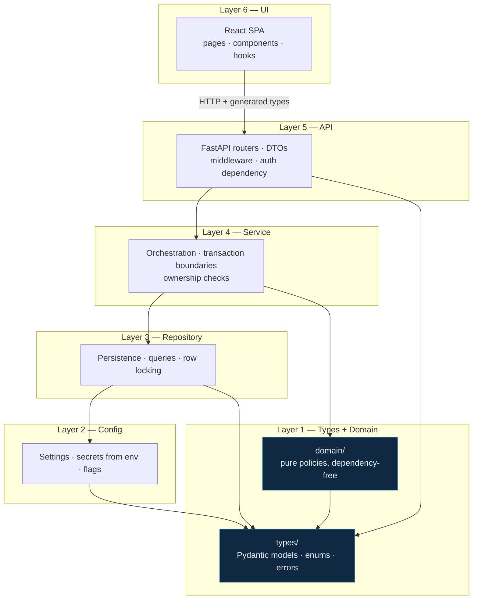
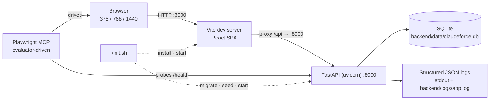
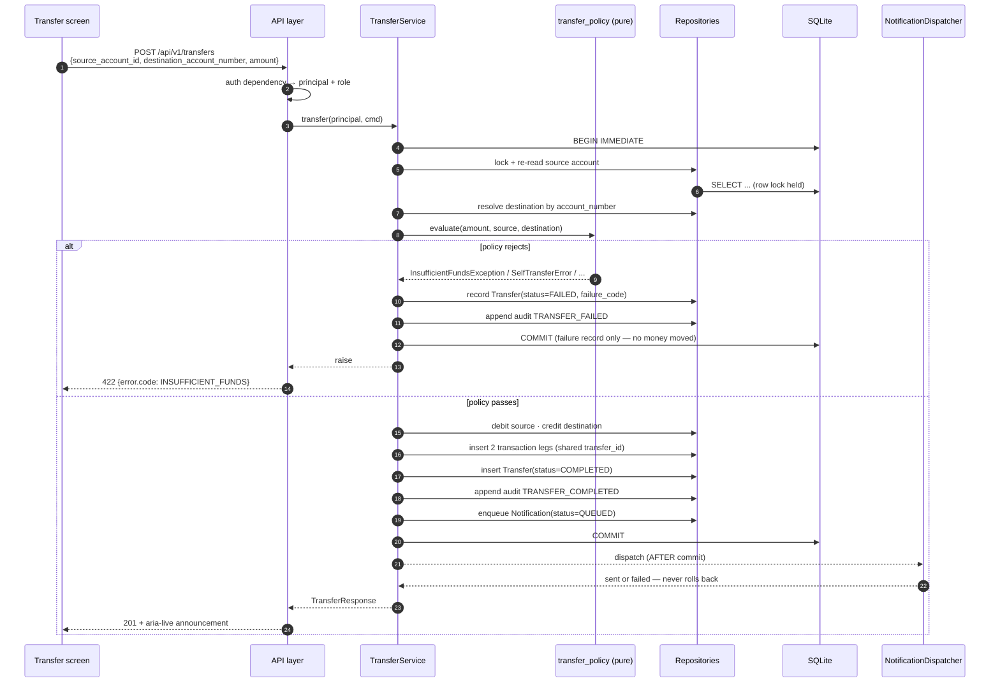

# System Design — ClaudeForge Banking Suite

| Field | Value |
|---|---|
| Business Case ID | BC-AINE-001 |
| Client | Horizon Bank (retail / digital banking) |
| Inputs | `specs/brd/brd.md`, 40 stories in `specs/stories/`, `specs/design/architecture-brainstorm.md` |
| Companion documents | `api-contracts.md`, `data-models.md`, `folder-structure.md`, `component-map.md`, `deployment.md` |
| Status | Awaiting human approval before `/build` |

---

## 1. Overview

A layered modular monolith. A FastAPI backend organised in six strictly ordered layers, a React
single-page frontend, and a SQLite database — all started by one command, `./init.sh`.

The interesting engineering constraint is not the feature set. It is that **no production code
may be hand-written**: every line is generated by Claude Code agents under human supervision.
That inverts the usual priorities. The design's job is to be *precise enough to generate from*
and *structured enough to verify automatically*. So the layer rules are executable tests rather
than conventions, the money type is enforced by a write-time hook rather than a code-review
habit, and the audit ledger's immutability is defended three separate ways rather than trusted
to a repository method that happens not to exist yet.

---

## 2. Component architecture

### 2.1 Layer map

Dependencies flow **downward only**. Enforced at write time by
`.claude/hooks/check-architecture.js` and at test time by `tests/architecture/` (NFR-08).



Two rules carry structural tests of their own:

- **`domain/` is a Layer-1 sibling of `types/`, not a subordinate of `service/`.** It imports
  `types` and nothing else — no config, no repository, no session, no I/O. Business rules are
  pure functions over value objects, so each one is trivially unit-testable and individually
  coverable. This is the element retained from the rejected split-services option (BRD §7.3).
- **Controllers never call repositories.** The API layer talks to the Service layer only. A
  dedicated structural test greps for repository imports under `backend/src/api/`.

### 2.2 Cross-cutting modules

Audit and notification are consumed by nearly everything. Treated as peer features they would
create a dependency cycle, so both are built as **generic service modules** that depend only on
Types and Repository:

| Module | Built in | Consumed by | Cycle broken because |
|---|---|---|---|
| Audit ledger | Group C (`E3-S1`) | Accounts, transfers, loans, beneficiaries | Callers pass a generic `(actor, action, entity_type, entity_id, metadata)` tuple. The module imports nothing from transfers or loans |
| Notification | Group C (`E4-S3`) | Transfers, loans | Invoked through an event-shaped interface. Loans and transfers depend on it, never the reverse |

### 2.3 Runtime topology



Single node, single process per service, no external dependencies. `/health` performs a trivial
database round-trip and answers within 1s of successful startup (NFR-07); the evaluator probes
it with 5 retries at 2s backoff.

---

## 3. Critical data flows

### 3.1 Onboarding and KYC (AC-01)

```
register → status PENDING_KYC → submit KYC → deterministic stub verdict
   ├─ VERIFIED → status ACTIVE → login issues a 30-minute JWT
   └─ REJECTED → status stays PENDING_KYC → login returns 403 PENDING_KYC
```

Login before verification returns **403 `PENDING_KYC`**, not 401. The distinction is deliberate:
it is what makes AC-01's gating behaviour assertable separately from a bad-password failure
(E-09). The stub is deterministic (A-02) — a random verdict would make the rejection path
untestable.

### 3.2 Account opening (AC-02)

`POST /api/v1/accounts` allocates a unique 12-digit account number, inserts the row with
`balance = 0.00`, appends an `ACCOUNT_OPENED` audit entry, and commits. There is no opening
deposit and no minimum balance — a minimum-balance rule would directly contradict AC-02 and was
rejected (OUT-08).

### 3.3 Atomic transfer (AC-04, AC-05) — the correctness centre of the system



Four properties this flow guarantees:

1. **Atomicity.** Debit, credit, both ledger legs, the audit entry and the notification enqueue
   are inside one transaction. Any failure — including a failure of the audit write itself
   (E-16) — rolls back everything. Money never moves without an audit trail.
2. **No double-spend.** The source row is locked and its balance re-read *inside* the lock. Two
   concurrent transfers serialise; the second sees the updated balance (E-07).
3. **Failed attempts are still evidence.** A rejected transfer writes a `FAILED` transfer row and
   an audit entry, but moves no money (A-08). AC-09 requires an audit of all transactions, and a
   rejected attempt is an auditable event.
4. **Dispatch cannot undo a commit.** Notification dispatch happens strictly after commit. A
   gateway failure marks the notification `FAILED`; the transfer stands (E-18).

**The destination is an account number, entered directly.** AC-04 says "transfer money to
another account" and states no beneficiary precondition. Beneficiaries are AC-06, an independent
convenience feature. See DD-13.

### 3.4 Loan lifecycle (AC-07, AC-08)

```
customer applies → APPLIED
admin reviews    → UNDER_REVIEW
admin decides    → APPROVED (reason mandatory) | REJECTED (reason mandatory)
admin disburses  → DISBURSED (credits an ACTIVE savings account of the applicant)
```

Every transition writes an append-only `loan_state_transitions` row carrying actor, timestamp
and reason, appends an audit entry, and enqueues a notification — so AC-10's "every loan state
transition" is satisfied by construction rather than by remembering to call something.

Illegal transitions return 409 (E-11, E-12). `REJECTED` and `DISBURSED` are terminal.
Disbursement to a closed account returns 409 (E-22).

**Application validation is structural only** — principal > 0 at ≤ 2dp, tenure a positive whole
number of months. There is no eligibility computation, because the brief specifies none.

---

## 4. Cross-cutting concerns

| Concern | Mechanism | Requirement |
|---|---|---|
| Money precision | `Decimal` end to end; `Numeric(18,2)` at rest; decimal **string** on the wire; `money-precision-check` hook flags `float(`, `%f`, float-typed money annotations | NFR-01 |
| Audit immutability | Repository with no update/delete method · SQLite `BEFORE UPDATE`/`BEFORE DELETE` triggers · `audit-immutability-check` hook | NFR-02 |
| Secret hygiene | Argon2id password hashes; redaction filter strips passwords, tokens and document numbers before log emission; `pii-scrub`, `protect-env`, `detect-secrets` hooks | NFR-03 |
| Authentication | JWT bearer verified by a single API-layer dependency; no route bypasses it except `/health` and the three unauthenticated auth routes | NFR-04 |
| Migrations | Alembic, append-only; a shipped migration is never edited — corrections are new migrations | NFR-05 |
| Observability | JSON logs with a correlation id generated at middleware entry, echoed on `X-Correlation-ID`, propagated through Service, and stored on every audit entry | NFR-06 |
| Liveness | `GET /health`, unversioned, trivial DB round-trip, < 1s | NFR-07 |
| Architecture | `check-architecture.js` at write time plus ≥ 3 structural tests in `tests/architecture/` | NFR-08 |

**Ownership checks live in the Service layer.** It verifies the principal owns the referenced
account, beneficiary or loan and returns 403 — never 404-as-403 leakage on an owned-resource
probe (E-19).

---

## 5. Design Decisions

DD-01..DD-09 were locked by the approved BRD and are restated so no builder agent re-litigates
them. DD-10..DD-20 were open at design time and are resolved here.

### DD-01 — Layered modular monolith
FastAPI backend in `backend/src/{types,config,domain,repository,service,api}`, React SPA in
`frontend/`, SQLite, one `./init.sh`. Option B (server-rendered, no separate frontend) was
rejected because it forfeits the brief's §7.2 frontend-evidence marks. Option C (split auth and
core services over HTTP) was rejected because it breaks AC-04's atomicity across a network
boundary, forcing a distributed transaction or a saga for zero grading benefit.

### DD-02 — `domain/` is a Layer-1 sibling of `types/`
Dependency-free policy package importing `types` only. Pure functions over value objects.
Satisfies the brief's requirement for ≥ 4 rule/policy/validator files and makes each rule
individually coverable.

### DD-03 — SQLite with append-only Alembic migrations
Real ACID transactions for AC-04 with zero infrastructure. Write concurrency is limited, which
is immaterial at this scale — it means the concurrency test asserts serialisation rather than
parallel throughput.

### DD-04 — JWT bearer, access-token only, 30 minutes, stateless
Roles `CUSTOMER` and `ADMIN`. Admin is seeded by `backend/scripts/seed.py`; there is no
self-service admin registration, because anonymous privilege escalation would violate NFR-04.
No refresh tokens, no MFA, no password reset — none is in AC-01.

### DD-05 — Money is `Decimal` in memory, `NUMERIC(18,2)` at rest, a string on the wire
Never `float`, at any layer. JSON numbers are IEEE-754 and would corrupt balances in transit.

### DD-06 — Transfer atomicity via one transaction and a source-row lock
Lock, re-read inside the lock, evaluate policy, then debit + credit + two ledger legs + audit
entry + notification enqueue, then commit. Any failure rolls back everything.

### DD-07 — Audit append-only, enforced three ways
Repository API with no update or delete method; SQLite triggers that `RAISE(ABORT)`; a write-time
hook. One mistake at any single level cannot defeat the guarantee.

### DD-08 — Notifications persisted **and** logged
The table makes AC-10 directly assertable in tests and visible in the admin UI; the structured
log line satisfies the brief's "log-to-file is acceptable" allowance. Enqueue in-transaction,
dispatch out-of-transaction.

### DD-09 — Local deployment only
`./init.sh`, backend :8000, frontend :3000. Production deployment, multi-region and distributed
locking are out of scope per the brief.

### DD-10 — Uniform error envelope
`{"error": {code, message, field_errors, correlation_id}}` on **every** 4xx and 5xx.

*Rationale.* Story E1-S1 requires every `DomainError` subclass to carry a machine-readable
`error_code`. That attribute is worthless if the API layer discards it — the UI must distinguish
`INSUFFICIENT_FUNDS` from a generic 422 without string-matching prose, because AC-05 is graded
on that specific failure being unmistakable. RFC 7807 was considered and rejected only because
its `type` URI is dead weight for a local single-app deployment; the shape is otherwise
equivalent.

### DD-11 — Page/size pagination with a total
`?page=1&size=20`, response `{items, page, size, total, total_pages}`, `size` capped at 100.

*Rationale.* A-06 already fixes default size 20, most-recent-first. Statements are read by a
human scrubbing backwards through a list, which is the access pattern page numbers serve.
Keyset paging buys stability under concurrent insert — real, but the data is seeded and the cost
is a UI that cannot say "page 3 of 7". `COUNT(*)` over a per-account index is trivial here.

### DD-12 — TypeScript types generated from the OpenAPI document
`openapi-typescript` reads `/openapi.json` and emits `frontend/src/lib/api/schema.d.ts`,
committed and regenerated by an npm script. BRD §7.1 names Pydantic/TypeScript drift as the one
real disadvantage of the chosen option and names generation as the mitigation — this makes drift
structurally impossible. **Consequence:** money arrives in TypeScript as `string`; the frontend
formats it and performs no arithmetic on it.

### DD-13 — The transfer destination is an account number, not a beneficiary
`POST /api/v1/transfers` carries `destination_account_number`. There is no `beneficiary_id`
field on the request and no error code for "not a saved beneficiary".

*Rationale.* AC-04 says "transfer money to another account" and states no such gate. The BRD
withdrew the beneficiary precondition explicitly (A-03), the dependency graph deliberately omits
the `E4-S2 → E4-S4` edge (DR-17), and the stories carry negative assertions that grep for
beneficiary-precondition identifiers and require zero matches. The transfer screen offers saved
beneficiaries as an optional autofill shortcut that writes into the account-number field; the
field stays directly editable at all times. There is no code path, schema constraint or UI state
in which a transfer requires a beneficiary to exist.

### DD-14 — Four rules that must not appear anywhere
Reintroducing any of these fails a story test.

1. **No transfer cap, daily limit or velocity control.** No `max_transfer_amount`,
   `daily_limit`, `velocity`, `CapExceeded`, no per-day aggregation.
2. **No beneficiary precondition on transfers.** See DD-13. No `NotBeneficiaryError`.
3. **No applicant age or date-of-birth eligibility gate.** `date_of_birth` is profile data
   consumed by nothing.
4. **No loan eligibility computation.** No principal bounds, no tenure bounds, no income
   threshold, no instalment-to-income ratio, no credit score, no risk band, no
   `EligibilityError`. `declared_monthly_income` is optional and informational and no rule reads
   it. Loan approval is an administrator decision (AC-08). The only loan validation is
   structural: principal > 0 at ≤ 2dp, tenure a positive whole number of months, and the legal
   state-transition matrix.

Where the brief is silent, the design stays silent.

### DD-15 — `metadata_json` is opaque
A JSON object column written by the caller and never queried by a `WHERE` predicate on its
interior. Audit filtering uses first-class indexed columns only: `action`, `entity_type`,
`entity_id`, `actor_id`, `occurred_at` range. Keeping metadata opaque is what lets the audit
module accept a generic tuple and import nothing from transfers or loans — the cycle break.

### DD-16 — Money as a schema constraint, not prose
Every money field in both schema files carries
`{"type": "string", "pattern": "^-?\\d{1,16}(\\.\\d{1,2})?$"}`. In OpenAPI the same fields add
`"format": "decimal"`. A JSON number in a money position is a contract violation the evaluator
can detect mechanically.

### DD-17 — `/health` is unversioned and outside `/api/v1`
It is infrastructure, not product surface, and `project-manifest.json` hard-codes
`http://localhost:8000/health` in both `evaluation.health_check` and
`verification.health_check.url`.

### DD-18 — Correlation ID propagation
Generated at middleware entry when the client did not supply `X-Correlation-ID`; echoed on every
response; carried into every log line and into `audit_entries.correlation_id`. This makes NFR-06
assertable end to end and gives the ledger a join key back to the log stream.

### DD-19 — Beneficiary removal is a soft delete
`deleted_at` nullable timestamp (A-07); list queries filter `deleted_at IS NULL`. Hard deletion
would orphan transaction and audit references, conflicting with NFR-02's spirit. A partial
unique index on (`customer_id`, `beneficiary_account_number`) `WHERE deleted_at IS NULL` lets the
same payee be re-added after removal.

### DD-20 — Invented Horizon Bank identity
No brand exists. `calibration-profile.json` weights `design_quality` and `originality` at 1.5x
with a per-criterion floor of 5 and an overall threshold of 8, so a framework-default theme
fails the ratchet gate. Direction: trustworthy financial software, not fintech novelty — a
restrained palette anchored on deep ink/navy with one decisive accent, generous whitespace,
tabular figures so money columns align, state colour reserved strictly for state, no gradient on
a balance, no ambiguity on a failure. Money is the loudest element on any screen it appears on.
Tokens are defined once in `specs/design/mockups/E6-S1.html` and reused verbatim by every other
mockup.

---

## 6. Traceability

### 6.1 Acceptance criteria

| AC | Requirement | Components | Sprint group |
|---|---|---|---|
| AC-01 | Register, KYC stub, log in | `domain/kyc_policy` · `service/auth_service` · `api/routes/auth` · `api/dependencies/auth` | G1 |
| AC-02 | Open savings account at `0.00` | `domain/money` · `service/account_service` · `api/routes/accounts` | G2 |
| AC-03 | View balance and statements | `repository/transaction_repository` · `service/account_service` · `api/routes/accounts` | G2 |
| AC-04 | Atomic transfer | `domain/transfer_policy` · `service/transfer_service` · `api/routes/transfers` | G3 |
| AC-05 | `InsufficientFundsException` | `domain/transfer_policy` · `types` error hierarchy | G3 |
| AC-06 | Add / remove beneficiaries | `service/beneficiary_service` · `api/routes/beneficiaries` | G3 |
| AC-07 | Loan apply and status flow | `domain/loan_eligibility_policy` · `service/loan_service` · `api/routes/loans` | G4 |
| AC-08 | Admin approve / reject with reason | `domain/loan_eligibility_policy` · `api/routes/admin_loans` | G4 |
| AC-09 | Admin audit log | `repository/audit_repository` · `api/routes/admin_audit` | G2 module → G4 viewer |
| AC-10 | Notification on transfer and every loan transition | `service/notification_service` | G3 module → G4 |

### 6.2 Non-functional requirements

| NFR | Enforcement | Verified by |
|---|---|---|
| NFR-01 | `domain/money.py`, `money-precision-check` hook, Decimal-preserving column type | Precision unit tests; schema pattern check |
| NFR-02 | Repository API, SQLite triggers, `audit-immutability-check` hook | Trigger test asserting `UPDATE`/`DELETE` aborts |
| NFR-03 | Argon2id, redaction filter, `pii-scrub` / `detect-secrets` hooks | Log-content tests asserting absence |
| NFR-04 | Single API-layer auth dependency | 401/403 route tests; structural test |
| NFR-05 | Alembic append-only policy | Migration-history test |
| NFR-06 | Correlation-ID middleware, JSON formatter | Log-shape tests |
| NFR-07 | `/health` with a DB round-trip | Evaluator probe, 5 retries / 2s backoff |
| NFR-08 | `check-architecture.js` + `tests/architecture/` | ≥ 3 structural tests |

---

## 7. Risks carried into build

| # | Risk | Mitigation |
|---|---|---|
| R-01 | A `float` creeps into a money path through a library boundary or JSON round-trip | `money-precision-check` hook; decimal-string serialisation; explicit precision tests |
| R-05 | Architecture drift — a controller reaching into a repository | Write-time hook plus structural tests |
| R-06 | Spec and code diverge silently | Spec-Is-Truth; the evaluator compares response shapes against `api-contracts.schema.json` |
| R-09 | An agent reintroduces one of the four withdrawn rules while filling in a form or a validator | DD-14 states them as an explicit deny-list; story-level negative greps fail the build |
| R-10 | Generated TypeScript drifts from the Pydantic models | DD-12 generation from `/openapi.json`; regeneration is an npm script, not a manual step |
