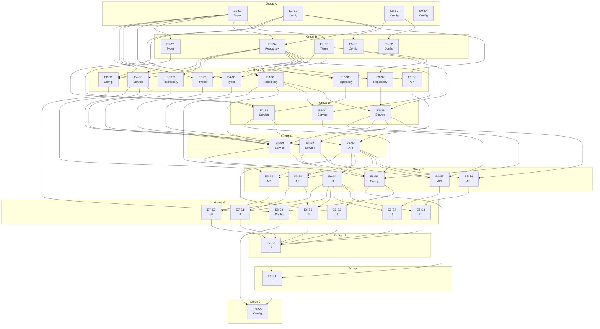

# Dependency Graph — ClaudeForge Banking Suite

40 stories across 9 epics, resolved into 10 sequential execution groups. Stories within a group have no dependency on one another and are independently executable in parallel. A group may not start until every group before it has completed.

The graph is acyclic: every dependency edge runs strictly from an earlier group to a later one. This was verified programmatically by depth-first cycle detection and by recomputing each group from the longest dependency path and comparing it against the declared value.

## Cycle avoidance

Two cross-cutting modules would otherwise create cycles and are deliberately placed low in the graph:

- **Audit ledger (`E3-S1`, group C)** depends only on the persistence foundation. Callers pass a generic `(actor, action, entity_type, entity_id, metadata)` tuple, so the module never imports transfers or loans. This breaks the apparent "audit needs transactions / transactions need audit" cycle.
- **Notification module (`E4-S3`, group C)** likewise depends only on Types and Repository and is invoked by the Service layer through an event-shaped interface, so loans and transfers depend on it and never the reverse.

Per **DR-17** beneficiaries are *not* a precondition of a transfer, so there is no `E4-S2 → E4-S4` edge; the transfer service depends on the transfer policy, the notification module and the account service only.

## Execution groups

### Group A — 4 stories

| Story | Title | Epic | Layer | Depends on |
|---|---|---|---|---|
| `E1-S1` | Define core domain types, enums and typed error hierarchy | `E1` | Types | — |
| `E1-S2` | Provide the Config layer with environment-sourced secrets and runtime settings | `E1` | Config | — |
| `E8-S2` | Layer the banking-specific substrate of hooks, skills, commands and agents | `E8` | Config | — |
| `E9-S4` | Make specs/app_spec.md the authoritative AC and NFR source and de-duplicate CLAUDE.md | `E9` | Config | — |

### Group B — 5 stories

| Story | Title | Epic | Layer | Depends on |
|---|---|---|---|---|
| `E1-S3` | Implement the pure money domain policy enforcing fixed-point arithmetic | `E1` | Types | `E1-S1` |
| `E1-S4` | Establish the persistence foundation with a Decimal-preserving column type and Alembic baseline | `E1` | Repository | `E1-S1`, `E1-S2` |
| `E2-S1` | Implement the KYC domain policy with deterministic stub verification | `E2` | Types | `E1-S1` |
| `E9-S2` | Add a programmatic Claude Agent SDK script | `E9` | Config | `E8-S2` |
| `E9-S3` | Package the banking substrate as a root plugin.json | `E9` | Config | `E8-S2` |

### Group C — 9 stories

| Story | Title | Epic | Layer | Depends on |
|---|---|---|---|---|
| `E1-S5` | Deliver the observability spine: health endpoint, JSON logs, correlation ID and PII redaction | `E1` | API | `E1-S2`, `E1-S4` |
| `E2-S2` | Build customer and KYC record repositories | `E2` | Repository | `E1-S4` |
| `E3-S1` | Build the append-only audit ledger with repository, trigger and hook enforcement | `E3` | Repository | `E1-S4` |
| `E3-S2` | Build account and transaction repositories with balance locking support | `E3` | Repository | `E1-S4`, `E1-S3` |
| `E4-S1` | Implement the transfer domain policy | `E4` | Types | `E1-S1`, `E1-S3` |
| `E4-S3` | Build the notification module with in-transaction enqueue and out-of-transaction dispatch | `E4` | Service | `E1-S4`, `E1-S1` |
| `E5-S1` | Implement the loan policy: state machine, structural validation and mandatory reason | `E5` | Types | `E1-S1`, `E1-S3` |
| `E5-S2` | Build loan application and append-only state transition repositories | `E5` | Repository | `E1-S4` |
| `E8-S1` | Enforce the layered architecture with structural tests | `E8` | Config | `E1-S1`, `E1-S2`, `E1-S4` |

### Group D — 3 stories

| Story | Title | Epic | Layer | Depends on |
|---|---|---|---|---|
| `E2-S3` | Implement the auth service: registration, KYC submission, activation and JWT issuance | `E2` | Service | `E1-S2`, `E2-S1`, `E2-S2` |
| `E3-S3` | Implement the account service with ownership checks and audited account opening | `E3` | Service | `E3-S1`, `E3-S2`, `E1-S3` |
| `E4-S2` | Implement beneficiary management as an independent convenience feature | `E4` | Service | `E1-S4`, `E3-S1` |

### Group E — 3 stories

| Story | Title | Epic | Layer | Depends on |
|---|---|---|---|---|
| `E2-S4` | Expose auth routes and the bearer-token authentication and role guard | `E2` | API | `E2-S3`, `E1-S5` |
| `E4-S4` | Implement the atomic transfer service with row locking and full rollback | `E4` | Service | `E4-S1`, `E4-S3`, `E3-S3` |
| `E5-S3` | Implement the loan service covering application, review decisions and disbursement | `E5` | Service | `E5-S1`, `E5-S2`, `E3-S1`, `E4-S3`, `E3-S3` |

### Group F — 6 stories

| Story | Title | Epic | Layer | Depends on |
|---|---|---|---|---|
| `E3-S4` | Expose authenticated account and statement endpoints | `E3` | API | `E3-S3`, `E2-S4` |
| `E4-S5` | Expose transfer and beneficiary endpoints with precise failure codes | `E4` | API | `E4-S4`, `E4-S2`, `E2-S4` |
| `E5-S4` | Expose customer loan endpoints and the admin review queue | `E5` | API | `E5-S3`, `E2-S4` |
| `E5-S5` | Expose the admin audit ledger and notification log viewers | `E5` | API | `E3-S1`, `E4-S3`, `E2-S4` |
| `E6-S1` | Establish the frontend foundation, design tokens and generated API types | `E6` | UI | `E2-S4` |
| `E8-S3` | Deliver synthetic seed data and the single-command local run | `E8` | Config | `E5-S3`, `E4-S4`, `E2-S3`, `E3-S3` |

### Group G — 7 stories

| Story | Title | Epic | Layer | Depends on |
|---|---|---|---|---|
| `E6-S2` | Build the registration, KYC submission and login screens | `E6` | UI | `E6-S1`, `E2-S4` |
| `E6-S3` | Build the dashboard and account detail screens | `E6` | UI | `E6-S1`, `E3-S4` |
| `E6-S4` | Build the beneficiaries and transfer screens | `E6` | UI | `E6-S1`, `E4-S5` |
| `E6-S5` | Build the customer loans screen with application and status timeline | `E6` | UI | `E6-S1`, `E5-S4` |
| `E7-S1` | Build the administrator loan review queue | `E7` | UI | `E6-S1`, `E5-S4` |
| `E7-S2` | Build the administrator audit ledger and notification log viewers | `E7` | UI | `E6-S1`, `E5-S5` |
| `E8-S4` | Wire the GitLab CI pipeline with build, test and coverage gates | `E8` | Config | `E8-S1`, `E8-S3` |

### Group H — 1 story

| Story | Title | Epic | Layer | Depends on |
|---|---|---|---|---|
| `E7-S3` | Complete the responsive layout and WCAG 2.1 AA accessibility pass | `E7` | UI | `E6-S2`, `E6-S3`, `E6-S4`, `E6-S5`, `E7-S1`, `E7-S2` |

### Group I — 1 story

| Story | Title | Epic | Layer | Depends on |
|---|---|---|---|---|
| `E9-S1` | Configure Playwright MCP and prove the evaluator exercises it | `E9` | UI | `E7-S3`, `E8-S3` |

### Group J — 1 story

| Story | Title | Epic | Layer | Depends on |
|---|---|---|---|---|
| `E9-S5` | Produce the engineering documentation set and record an autonomous fix loop | `E9` | Config | `E8-S4`, `E9-S1` |

## Mermaid diagram

## Layer distribution by group

| Group | Types | Config | Repository | Service | API | UI | Total |
|---|---|---|---|---|---|---|---|
| A | 1 | 3 | — | — | — | — | 4 |
| B | 2 | 2 | 1 | — | — | — | 5 |
| C | 2 | 1 | 4 | 1 | 1 | — | 9 |
| D | — | — | — | 3 | — | — | 3 |
| E | — | — | — | 2 | 1 | — | 3 |
| F | — | 1 | — | — | 4 | 1 | 6 |
| G | — | 1 | — | — | — | 6 | 7 |
| H | — | — | — | — | — | 1 | 1 |
| I | — | — | — | — | — | 1 | 1 |
| J | — | 1 | — | — | — | — | 1 |

Foundation layers (Types, Config, Repository) resolve into the earliest groups and UI stories into the latest, as required.

